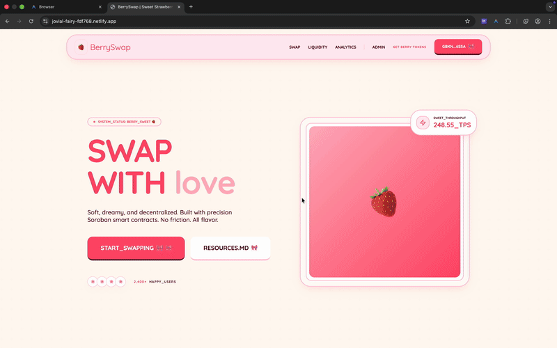
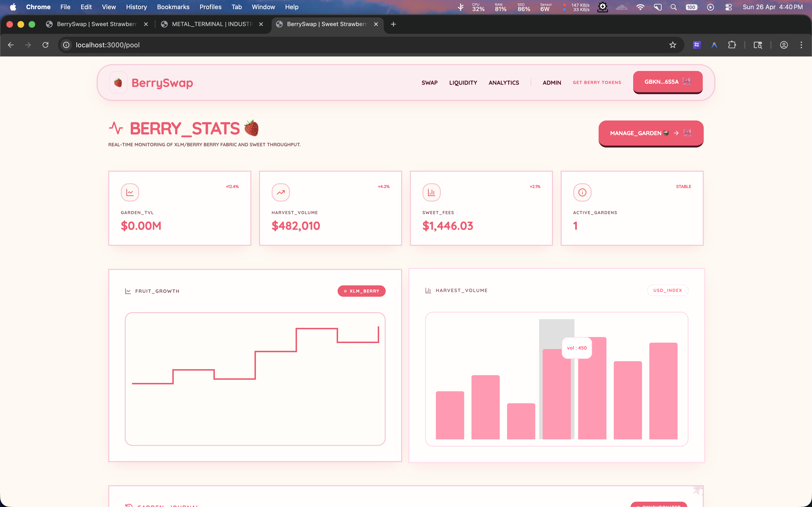
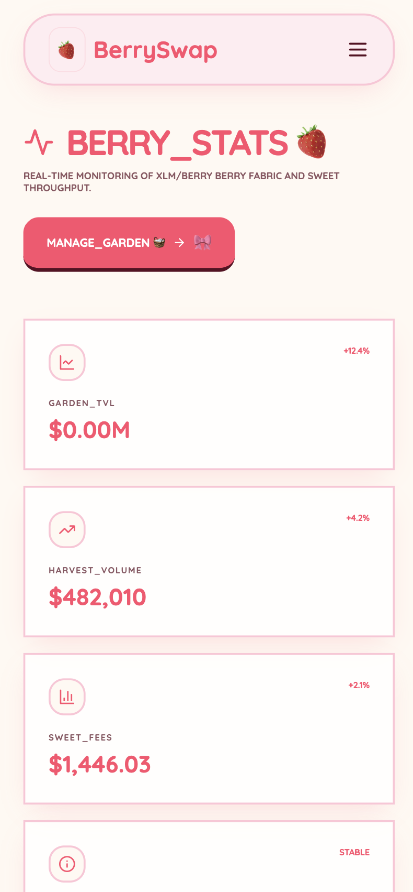
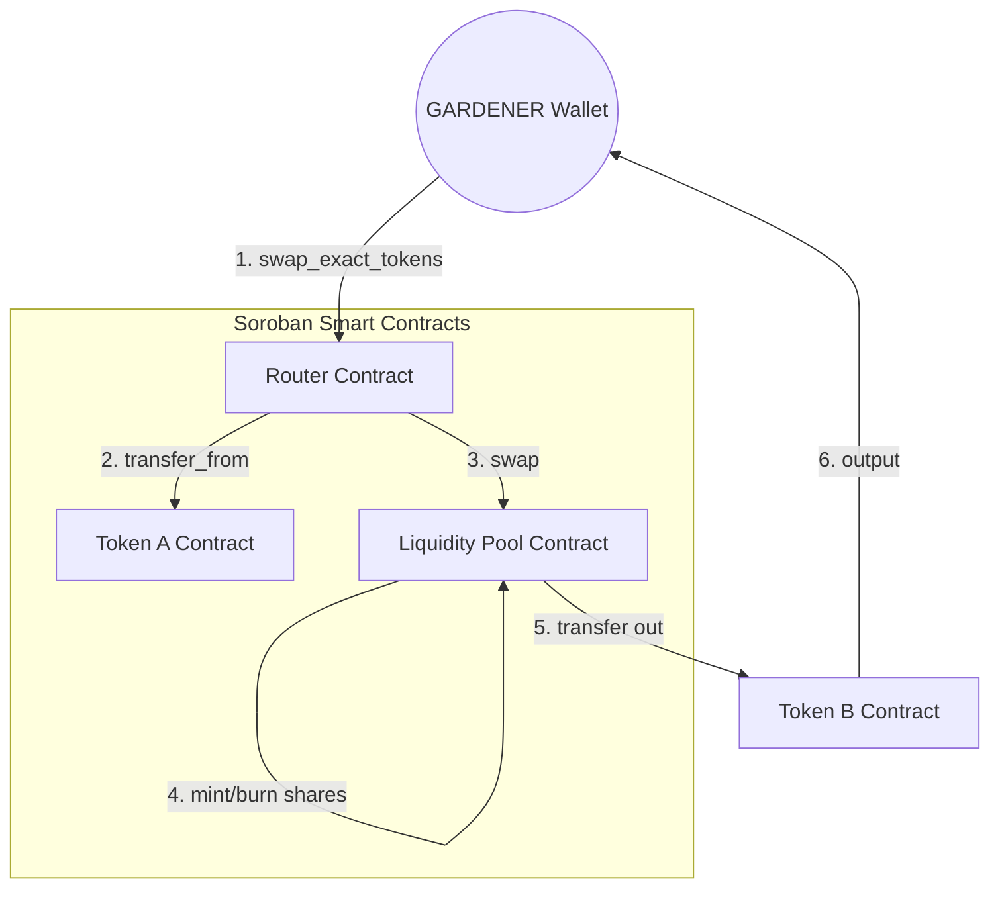

# 🍓 BerrySwap

  
<strong>The Sweetest DEX on Blockchain. Fresh Liquidity. Dreamy Swaps. 🎀</strong>

  
  
  
  
  

---

### 🌸 [Live Demo](https://jovial-fairy-fdf768.netlify.app/) | [📖 Documentation](#-visual-showcase)

BerrySwap is a soft and dreamy Decentralized Exchange (DEX) protocol built on the Blockchain network using Soroban smart contracts. It enables sweet, atomic trading and liquidity provision with a high-fidelity "Coquette" aesthetic.

## ✨ Features

- **Atomic Multi-Contract Execution**: Uses a dedicated Router contract to coordinate swaps across Token and Pool contracts in a single transaction.
- **AMM Constant Product Formula**: Implements $x \times y = k$ logic with a 0.3% protocol fee for liquidity providers (the Gardeners).
- **Real-Time Event Streaming**: Sub-second trade awareness powered by Network event polling.
- **Premium Strawberry UI**: High-fidelity trading desk built with Next.js 14, Framer Motion, and Tailwind CSS.
- **Dreamy Aesthetics**: Professional soft-pink themed design system with rounded interfaces and vibrant strawberry accents.

## 📱 Visual Showcase

### 🍓 Dashboard & Interface
The main trading interface allows users to swap tokens with ease, featuring a real-time price chart and detailed token specifications.

### 🎀 Interaction Gallery
Explore the smooth transitions and dreamy components that make BerrySwap unique.

| Swap Flow | Token Selection | Transaction Success |
|:---:|:---:|:---:|
|  |  |  |

### 🛠️ Admin Panel
The administrative dashboard for managing liquidity pools and protocol parameters.

## 🏗️ Technical Architecture

BerrySwap utilizes a hub-and-spoke execution model where the **Router** contract orchestrates interactions between standard tokens and liquidity reserves.

## 📜 Berry Registry (Testnet)

| Item | Value | Verification |
|------|-------|:---:|
| **Network** | Blockchain Testnet | [View Network](https://developers.stellar.org/docs/fundamentals-and-concepts/network-passphrases) |
| **Token Asset Code** | `BERRY` | - |
| **Token Issuer Address** | `GBKNHIATMCYTFZZZUX347NF2SCH7MKMT7HS73HOVCC55CDJEI53I6S5A` | [Verify Issuer](https://stellar.expert/explorer/testnet/account/GBKNHIATMCYTFZZZUX347NF2SCH7MKMT7HS73HOVCC55CDJEI53I6S5A) |
| **Router Contract ID** | `CBNKNOG37YHDBIAZDMDDLR2CVZ2KVJKASOM2APWSIFZ5ECGIRS3A6B55` | [Verify Router](https://stellar.expert/explorer/testnet/contract/CBNKNOG37YHDBIAZDMDDLR2CVZ2KVJKASOM2APWSIFZ5ECGIRS3A6B55) |
| **Liquidity Pool ID** | `GBSDMBQCO3Q73LABJKLHVGRAIBKESOXBATZ5UTMJE6PMQ6N6X4CQPNBM` | [Verify Orchard](https://stellar.expert/explorer/testnet/account/GBSDMBQCO3Q73LABJKLHVGRAIBKESOXBATZ5UTMJE6PMQ6N6X4CQPNBM) |
|**Sample Transaction Hash**| `17fe9879704a46ce0d2193e0ea1ed4263c2af3c8901ffa20bb3a1b11b8560cce` [Explorer Link] (https://stellar.expert/explorer/testnet/op/9322265170681857)|

## 🛠️ Tech Stack

- **Smart Contracts**: Soroban (Rust SDK v25.3.1)
- **Frontend**: Next.js 14, TypeScript, Tailwind CSS
- **Blockchain Interface**: Blockchain SDK, @stellar/freighter-api
- **CI/CD**: GitHub Actions

## 🧪 Test Coverage & CI/CD

BerrySwap maintains high standards for protocol reliability. Our test suite covers core smart contract logic, focusing on state transitions, authorization, and AMM invariants.

### Smart Contract Test Suite
| Token | Verified Logic | Test Cases | Status |
|----------|----------------|------------|:---:|
| **Token** | SEP-41 Compliance | test_token_lifecycle, test_transfer_insufficient_balance | ✅ |
| **Pool** | AMM Invariants | test_liquidity_pool_lifecycle | ✅ |
| **Router** | Atomic Swaps | test_router_swap, test_router_slippage_protection | ✅ |
